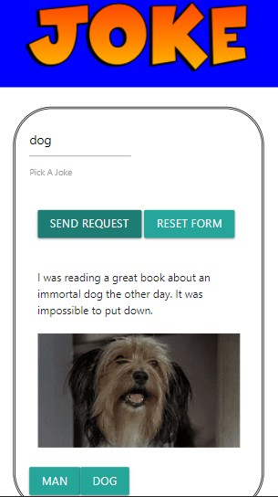

# Project 1 - Joke

## About Project
The goal for this project was to create an app combining two different api's. To view this project, [click here](https://topgek99.github.io/project-1/). The first api chosen was a joke api that stores thousands of jokes and allows the user to search for a particular joke using key words. The second api was a gif api that brings up random gifs based on key words that the user has chosen. To combine the two, the key word that is chosen by the user brings up both a joke and a gif.

USER STORY

I AM feeling sad and a bit bored

I WANT an application

WHERE I can search up a word

AND THEN the app will list different kinds of jokes

AND ALSO show funny gifs with it to cheer me up

## Installation
The technologies used include Materialize CSS, CSS, jQuery, AJAX and JavaScript. Although we worked together and helped each other out, the main breakdown of tasks and roles were Subhash and Grace on HTML/CSS and Alex and Silvia on javascript. Toward the end Silvia contributed to the CSS, and Grace helped with implementation of the JS/jQuery.
Challenges we faced were coming up with ideas, getting our api’s to work together rather than independently and improving the responsiveness of the page. In the end, we successfuly designed a responsive application that could retrieve information from both of the chosen api's and 
process simple logic within javascript.

## Usage
Here is an example of the working application

## License 
Creative Commons Attribution 4.0 International Public License

MIT License